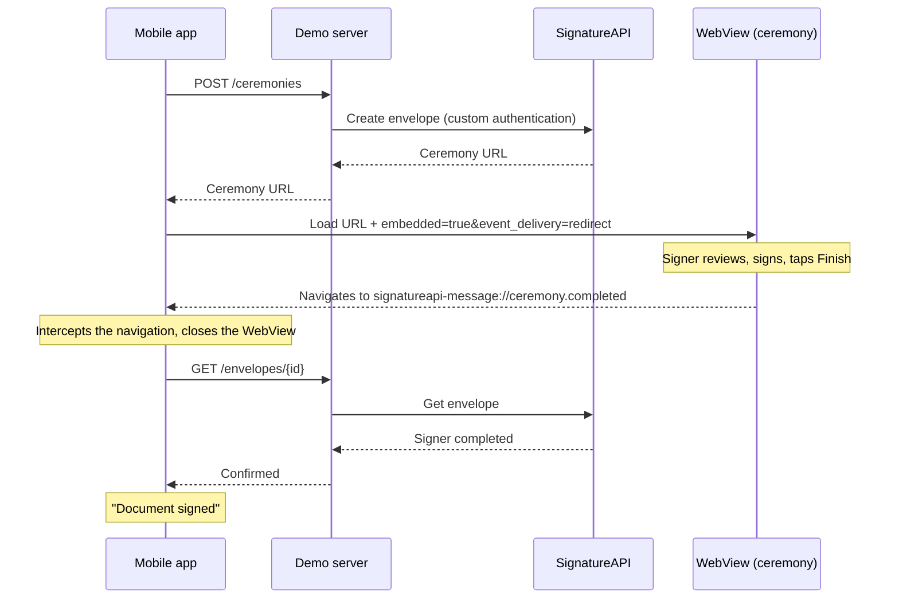

# SignatureAPI mobile integration demo

Embedded e-signing in native mobile apps with [SignatureAPI](https://signatureapi.com).

Tap a button, and the app creates a sample envelope, opens the signing ceremony in a WebView, and shows how it ended. The same app is built twice:

| Platform | Stack | WebView |
|---|---|---|
| [iOS](ios/) | SwiftUI, iOS 17+ | `WKWebView` |
| [Android](android/) | Jetpack Compose, Android 8.0+ (API 26) | `android.webkit.WebView` |

Both apps talk to a small [demo server](server/) that holds the SignatureAPI key and creates envelopes. The key never ships in the apps.

**New to embedding in a native app?** Read [Embedding SignatureAPI in native apps](docs/embedding-in-native-apps.md). It covers the pattern, the events, cookies and storage, iframes, link lifetime and testing, and every claim in it is checked by this repo's tests.

## How it works



The app treats `ceremony.completed` as a UI signal and shows "Document signed" only after the server confirms the envelope. A real integration would use a webhook for this.

## Quick start

You need a SignatureAPI account. Everything here runs in **test mode**: envelopes are not legally binding, and no emails are sent.

### 1. Start the demo server

Requires Node.js 22.18 or later.

```bash
cd server
npm install
npx --yes signatureapi init   # opens a browser to approve; writes a test key to .env without printing it
npm run dev
```

Or copy `.env.example` to `.env` and paste a test key (`key_test_…`) from the [dashboard](https://dashboard.signatureapi.com/settings/api-keys). The server refuses to start with a live key.

The server listens on port 3000. Set `PORT` in `.env` if that port is taken.

### 2. Run an app

- **iOS:** open `ios/SignatureAPIDemo.xcodeproj` in Xcode 26 and run on a simulator. For a device, see [ios/README.md](ios/README.md).
- **Android:** connect a device and forward the server port, then install:

  ```bash
  adb reverse tcp:3000 tcp:3000
  cd android && ./gradlew installDebug
  ```

  Needs JDK 17 and the Android SDK (platform 35). See [android/README.md](android/README.md).

Tap **Sign document**, sign, and tap **Finish**.

## Tests

The tests run real ceremonies against SignatureAPI test mode. Nothing is mocked.

| Suite | What it proves | Run |
|---|---|---|
| [Server](server/) | Envelope creation, framing rules (CSP `frame-ancestors`), resuming and replacing links, input validation, no ceremony URL in logs | `cd server && npm test` |
| [Browser](e2e/) | Events, errors, cookies and storage, iframe embedding, rotation and language, in WebKit (the engine behind `WKWebView`) and Chromium (the engine behind Android's WebView) | `cd e2e && npm test` |
| [iOS](ios/) | A real `WKWebView` intercepts the events; signing and canceling end on the right screen | `xcodebuild test` (see [ios/README.md](ios/README.md)) |
| [Android](android/) | A real Android WebView intercepts the events, on a device | `./gradlew connectedDebugAndroidTest` (see [android/README.md](android/README.md)) |

## Repository layout

```
server/    Demo backend (TypeScript, Express): creates envelopes, returns ceremony URLs
ios/       iOS app (SwiftUI) and its UI tests
android/   Android app (Jetpack Compose) and its instrumented tests
e2e/       Browser tests (Playwright): ceremony behavior in WebKit and Chromium
design/    Shared brand fonts and their licenses
docs/      Embedding guide
```

## License

[MIT](LICENSE). The fonts in [`design/fonts`](design/fonts) are under the SIL Open Font License 1.1; see [design/README.md](design/README.md).
